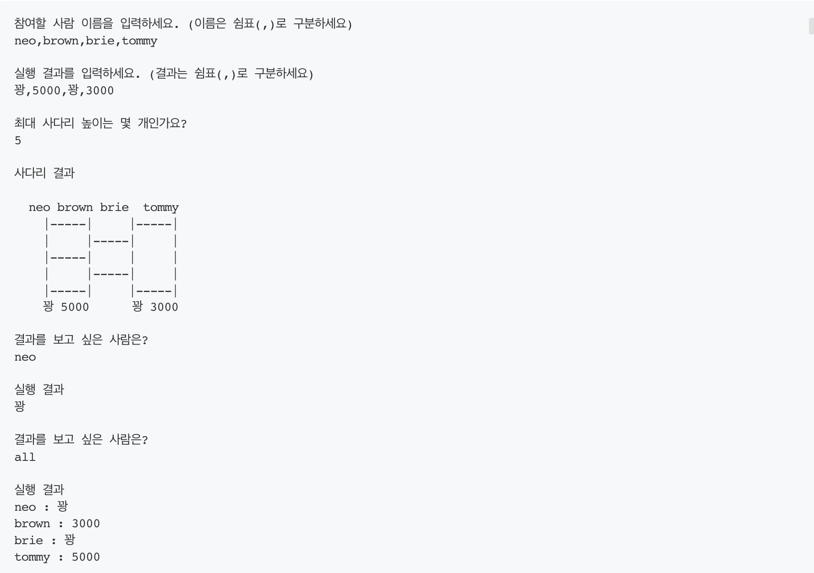

##### [네이버 사다리게임 ](https://search.naver.com/search.naver?where=nexearch&query=%EB%84%A4%EC%9D%B4%EB%B2%84+%EC%82%AC%EB%8B%A4%EB%A6%AC&ie=utf8&sm=tab_she&qdt=0)

- 참고하여 도메인을 분석하여 구현한다.
- 사다리는 4*4 크기로 거정한다.
- 연결 여부는 랜덤으로 결정한다.
- 사다리 타기가 정상적으로 동작하면 라인이 겹치지 않도록 해야한다.
- |----|-----| 모양과 같이 가로 라인이 겹치는 경우 어느 방향으로 이동할지 결정할 수 없다 .
-

##### 추가된 요구 사항

1. 모든 엔티티를 작게 유지한다.
2. 3개 이상의 인스턴스 변수를 가진 클래스를 쓰지 않는다.

###### 기존 프로그래밍 요구사항

- 자바 코드 컨벤션을 지키면서 프로그래밍을 한다.
    - 기본적으로 [Java Style Guide](https://github.com/woowacourse/woowacourse-docs/tree/main/styleguide/java)을 원칙으로 한다.
- depth를 2를 넘지 않도록 구현한다. 1까지만 허용
- 3항 연산자를 쓰지 않는다.
- else 금지
- 배열 대신 Collection사용한다.
- 줄여 쓰지 않는다.
- 함수 길이가 10라인을 넘지 않도록 구현한다.
- 원시 값과 문자열을 포장한다.
- 일급컬렉션을 사용한다.
- Java Enum 적용한다.
- [사다리 출력 힌트 ](https://edu.nextstep.camp/s/0DWD8BIx/ls/Qvl5V3oh)
  이전 값이랑 비교 해서 나왔면 안나오게 안나오면 나올수있고 안나올수있고
- 사다리의 시작 지점과 도착 지점을 출력한다.
- 

---------------------------------

### Controller

---------------------------------

### Model

Line
- [ ] Line 사다리를 관리하는 일급컬렉션 (숫자로 표현후 OutputView에서 사다리로 변경)
- [ ] Boolean hasPoint를 관리한다
Lines

- [ ] Lines (가로사다리) 관리하는 일급컬렉션
- [ ] Lines 가로 사다리가 5칸씩뒤에서 나오게 한다.

RawLine
-[ ] List<Lines>을관리한다. (사다리 한줄)
- 

Height
- [ ] int height 즉 사다리의 높이를 관리하는 원시값 포장 VO 객체이다.

Ladder

GenerateLadder

- [ ] 높이 사다리를 만드는 인터페이스

GenertareLadders:

- [x] 오버라이딩해서 사용하는 가로 사다리

---------------------------------

### View

InputView

- [x] 사다리 넓이를 입력받는 메서드
- [x] 사다리 높이를 입력받는 메서드

## 생각 정리 
------------------------------------
1. 사다리 step1에서는 4*4를 제한뒀다.(높이 넓이 4 * 4 ) 
2. 그러면 private static final widthnumber=4;로 선언한후 생성을 한다?
3. boolean을 통해 한다. 가로 사다리를 만나게 되면 count ++ 을해서 옆으로 이동하게한다.
4. 결국 A,B,C,D 라는 말이 있을 때 이 말들을 0,1,2,3 으로 치환해서 생각한후 ++ -- 를해준다?

   /**
  * 정적 팩토리 메서드 (생성 패턴)
  * 기본 생성자는 private 접근제어자로 닫아둔다.
  * 해당 정팩메에서는 로직을 처리한후 rowLines를 만들어준다.
  * 외부에선 생성자를 사용하지 못하고 Ladder.from(height)를 통해 객체를 생성한다.
    */

## 기능 구현 목록 가이드

### 접근 방법

- output을 보고 사다리가 어떻게 구성되어있는지 생각해본다.
- 가로선들 * 세로 높이 == 사다리의 구성
- 가로선이 있을 수도 있고 없을 수도 있으니 `Class Line = { Boolean hasPoint }` 선언
- 가로선은 `Class Lines = { List<Line> }` 선언
- 세로선은 사다리의 높이 `Height = { int height }` ==> 원시값 포장
- 사다리 한줄은 `Class RowLines = { List<Lines> }` ==> 일급 컬렉션
- 사다리의 클래스는 `Class Ladder = { RowLines, Height }`

### 접근한 후 클래스 선언 정리

- Line : Boolean hasPoint를 관리한다. 만약 true면 사다리간 이어주는 패달이 있는 것으로 간주한다.
- Lines : List<Line>을 관리한다. 즉 Lines는 사다리의 한줄을 의미한다
- RowLines : List<Lines>를 관리한다. 즉 `rowLines.size()는 사다리의 높이가 된다.`
- Height : int height 즉 사다리의 높이를 관리하는 원시값 포장 VO 객체이다.
- Ladder : RowLines 를 관리한다. 생성자로 height를 받으면 RowLines.size() == height 가 된다.

### 문제 풀기 위한 순서 생각
- Model 만든다
- TDD를 통해 실패하는 테스트를 먼저 만든 후 객체 하나씩 기능을 완성시킨다.
  - 객체의 책임을 생각하고, 역할(메서드)는 무엇인지 생각하는 연습을 한다.
  - 해당 미션처럼 어려운 미션은 작은 범위부터 객체를 완성시켜나가면서 큰 단위로 기능을 완성시킨다.